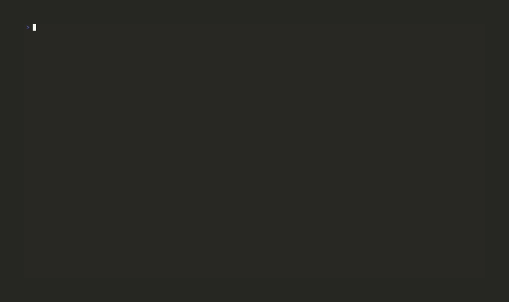

<div align="center">

# differ.nvim

**Your whole diff and review loop in one Neovim plugin: local diffs, file history, staging, PR review, and merge conflicts, all with the same UX.**

[](https://github.com/undont/differ.nvim/actions)
[](https://github.com/undont/differ.nvim/releases/latest)
[](LICENCE)
[](https://www.lua.org)
[](https://go.dev)
[](https://neovim.io)
[]()
[]()

[Features](#features) · [Status](#status) · [Installation](#installation) · [Usage](#usage) · [Configuration](#configuration) · [Development](#development)

</div>



---

You can already get most of this from existing plugins, just not all of it in one tool with the same feel. That's what I wanted, so I built it.

Everything runs through one renderer, so staging a hunk and replying to a review comment behave like the same tool, because they are. The default view is a stacked dual-rail layout: one scroll surface with old and new lines interleaved per hunk and both line numbers in the gutter. Side-by-side is a keystroke away from the same model. Word-level highlighting and Treesitter syntax are on by default.

The GitHub side runs in a separate process rather than the editor, so opening a PR or posting a review doesn't block on the API, and results are cached between calls.

---

## Features

- **Stacked dual-rail layout** with one scroll surface, old and new lines interleaved per hunk, and a dual line-number gutter via `statuscolumn`
- **Side-by-side layout** from the same hunk model, switchable at runtime as a pure re-render
- **PR review in the diff** with inline comment threads, pending-review drafts, thread resolve, per-file viewed-state, CI checks, and lifecycle actions (merge, checkout, ready/draft, close), backed by a Go sidecar that owns the GitHub API
- **File panel and staging** in a persistent sidebar with the changed-file tree, status icons, +/- counts, and hunk- and file-level staging
- **File history** for single files and branch ranges, walked commit-by-commit, each step a diff through the same engine
- **3-way merge tool** running base/ours/theirs through the n-column renderer, resolved into the working-tree file
- **Word-level highlighting** and **Treesitter syntax** on by default, so the diff reads like source instead of a grey block
- **Real buffer lines** for code, so search, yank, and motions all work; the hunk model is canonical and the buffer is a projection of it
- **One diff engine** (`vim.diff()`, histogram) shared by every source

---

## Requirements

- Neovim 0.10+ (uses `vim.system`, `vim.fs.relpath`, `vim.diff`)
- git on `PATH`
- A Treesitter parser for the languages you diff (optional, for the syntax pass)
- For PR review: Go + make on `PATH` (the sidecar is built on install via the `build` hook) and `gh` authenticated. Not needed for local diffs.

---

## Installation

### [lazy.nvim](https://github.com/folke/lazy.nvim)

```lua
{
  "undont/differ.nvim",
  build = "make go-build",
  config = function()
    require("differ").setup()
  end,
}
```

`setup()` is only needed to change defaults and register highlight groups eagerly. The `:Differ` command is registered on startup either way.

The `build` hook compiles the Go sidecar (used by PR review) on install and update. It needs Go and make on `PATH`; local diffs work without it, so you can drop the hook if you only want local diffing.

### vim.pack (Neovim 0.12+)

`vim.pack` has no inline build key, so register a `PackChanged` hook (before `vim.pack.add`, so it also runs on first install):

```lua
vim.api.nvim_create_autocmd("PackChanged", {
  callback = function(ev)
    if ev.data.spec.name == "differ.nvim" and (ev.data.kind == "install" or ev.data.kind == "update") then
      vim.system({ "make", "go-build" }, { cwd = ev.data.path }):wait()
    end
  end,
})

vim.pack.add({ "https://github.com/undont/differ.nvim" })
require("differ").setup()
```

Pin a release with `{ src = "https://github.com/undont/differ.nvim", version = "v0.1.1" }`.

### Other managers

differ's only install step is building the Go sidecar, so point your manager's build / post-update hook at `make go-build`: pckr `run`, vim-plug `do`, or the equivalent. It needs Go and make; drop it for local diffs only.

---

## Usage

`:Differ [revspec]` diffs the current file against a resolved source. The grammar mirrors git:

| Command | Diffs |
|---|---|
| `:Differ` | `HEAD` vs worktree (all uncommitted changes) |
| `:Differ <rev>` | `<rev>` vs worktree (changes since `<rev>`) |
| `:Differ <a>..<b>` | `<a>` vs `<b>` (two-dot range) |
| `:Differ <a>...<b>` | merge-base(`<a>`, `<b>`) vs `<b>` |
| `:Differ <a>...` | merge-base(`<a>`, `HEAD`) vs worktree (branch total) |
| `:Differ <a> <b>` | `<a>` vs `<b>` |

### Runtime controls

These re-render the active view only. No refetch, no re-diff, and the state is local to that view.

| Command | Effect |
|---|---|
| `:Differ layout [stacked\|split]` | Set layout; no argument flips it |
| `:Differ context <n>` | Set context lines around hunks |
| `:Differ context full` | Show the whole file |
| `:Differ context +` / `-` | Widen / narrow context by one |

Set `command_alias` in `setup()` to register a shorter name for the same command, e.g. `command_alias = "D"` gives `:D HEAD~1`, `:D log`. Names must start with an uppercase letter (enforced by vim, not by me).

If you lazy-load differ on `cmd = "Differ"`, the alias is only registered once `setup()` runs, so it can't trigger that load itself: the first `:D` of a session, before differ has loaded, errors with `E464` (it prefix-matches the `Differ` load stub). Either add the alias to `cmd` as well, as the spec below does:

```lua
cmd = { "Differ", "D" },
```

or skip `command_alias` and use a cmdline abbrev, which expands before the plugin loads so the name lives in one place:

```lua
vim.cmd [[cnoreabbrev <expr> D (getcmdtype() == ':' && getcmdline() ==# 'D') ? 'Differ' : 'D']]
```

### Keymaps

Buffer-local, scoped to each surface. All configurable via `keymaps` in `setup()`.

**Diff** (the stacked / split view)

| Key | Action |
|---|---|
| `]c` / `[c` | Next / previous hunk |
| `]f` / `[f` | Next / previous file |
| `f` / `b` | Scroll a quarter page down / up |
| `s` / `u` | Stage / unstage the hunk |
| `S` / `U` | Stage / unstage all |
| `d=` / `d-` | More / less context |
| `df` | Edit-in-review (uncommitted diffs) |
| `de` | Open the real file and end the session |

**Panel** (the file list)

| Key | Action |
|---|---|
| `<CR>` / `o` | Open the file under the cursor |
| `]f` / `[f` | Next / previous file |
| `gg` / `G` | Move cursor to first / last file |
| `]]` / `[[` | Next / previous section |
| `]c` / `[c` | Next / previous hunk |
| `i` | Toggle tree / name listing |
| `c` / `C` / `O` | Collapse node / collapse all / expand all |
| `s` / `u` / `S` / `U` | Stage / unstage file, or all |
| `X` | Discard changes |
| `R` | Refresh |
| `g?` | Help |

**History** (log / range mode)

| Key | Action |
|---|---|
| `<CR>` / `o` | Show the commit (file mode) / toggle fold (range mode) |
| `]f` / `[f` | Next / previous file (range) or commit (file mode) |
| `]]` / `[[` | Next / previous commit |
| `gg` / `G` | First / last commit |
| `za` | Toggle fold (range mode) |
| `c` | Collapse the commit under the cursor (range mode) |
| `O` / `C` | Expand / collapse every commit (range mode) |
| `K` | Commit details |
| `g?` | Help |

**PR review** (on top of the diff + panel keys)

| Key | Action |
|---|---|
| `<Tab>` | Toggle the GitHub "viewed" checkbox (panel) |
| `]u` / `[u` | Next / previous unviewed file |
| `]t` / `[t` | Next / previous review thread |
| `ga` | Comment on the line / selection |
| `gp` | Reply to the thread under the cursor |
| `gx` | Delete the latest comment in the thread |
| `gc` | Collapse / expand the thread |
| `gr` | Resolve / unresolve the thread |

**Merge tool** (the result buffer)

| Key | Action |
|---|---|
| `]x` / `[x` | Next / previous conflict |
| `<leader>co` / `ct` / `cb` | Take ours / theirs / base |
| `<leader>ca` | Take both (ours then theirs) |
| `dx` | Drop the conflict region |
| `q` | Close the merge tool |
| `g?` | Help |

The result buffer is the real worktree file, so `:w` writes it and stages it once the markers are gone, then opens the next conflicted file; when none remain the session reports done and closes. Use `:Differ close` to stop after the current file. Because it's a real file, a format-on-save would otherwise run over the conflict markers; the merge tool sets `vim.b.disable_autoformat` (conform's opt-out) for the session, so honour that flag in your `format_on_save` gate if you format on save. If a formatter reformats the markers anyway, differ notices on save, refuses to stage the file, and warns once that the flag isn't being honoured. The merge result also disables in-buffer markdown rendering (render-markdown.nvim) for the session so the conflict markers aren't concealed as block-quotes, restoring it on close.

### Launchers (a starting point)

differ ships no global launchers - only the in-view buffer maps above and the optional `command_alias`. These are the `<leader>` launchers I drive it with, as a lazy.nvim spec you can lift wholesale or trim to taste.

```lua
{
  "undont/differ.nvim",
  build = "make go-build",
  cmd = { "Differ", "D" }, -- "D" matches command_alias below; see note above
  keys = {
    -- local diff / history
    { '<leader>do', '<cmd>Differ HEAD<CR>',                   desc = "Diff: open (vs index)" },
    { "<leader>dc", "<cmd>Differ close<CR>",                  desc = "Diff: close" },
    { "<leader>dt", "<cmd>Differ base<CR>",                   desc = "Diff: branch total (vs base)" },
    { "<leader>de", "<cmd>Differ gofile<CR>",                 desc = "Diff: open the real file" },
    { '<leader>dd', '<cmd>Differ panel<CR>',                  desc = "Diff: panel toggle" },
    { "<leader>dh", "<cmd>Differ log<CR>",                    desc = "Diff: file history" },
    { "<leader>dp", "<cmd>Differ log origin/HEAD...HEAD<CR>", desc = "Diff: PR range (local, no API)" },
    { "<leader>dl", "<cmd>Differ layout<CR>",                 desc = "Diff: toggle layout" },
    -- pr review (sidecar + github)
    { "<leader>pl", "<cmd>Differ pr list<CR>",                desc = "PR: list" },
    {
      "<leader>po",
      function()
        vim.ui.input({ prompt = "PR number: " }, function(input)
          if input and input ~= "" then vim.cmd("Differ pr " .. input) end
        end)
      end,
      desc = "PR: open by number",
    },
    { "<leader>pr",  "<cmd>Differ pr review<CR>",         desc = "PR: review start" },
    { "<leader>pe",  "<cmd>Differ pr review resume<CR>",  desc = "PR: review resume" },
    { "<leader>pm",  "<cmd>Differ pr review submit<CR>",  desc = "PR: review submit" },
    { "<leader>pd",  "<cmd>Differ pr review discard<CR>", desc = "PR: review discard" },
    { "<leader>psm", "<cmd>Differ pr merge squash<CR>",   desc = "PR: squash merge" },
    { "<leader>pk",  "<cmd>Differ pr checks<CR>",         desc = "PR: checks" },
    { "<leader>pO",  "<cmd>Differ pr checkout<CR>",       desc = "PR: checkout" },
    { "<leader>pR",  "<cmd>Differ pr ready<CR>",          desc = "PR: mark ready" },
    { "<leader>pD",  "<cmd>Differ pr draft<CR>",          desc = "PR: mark draft" },
    { "<leader>pX",  "<cmd>Differ pr close<CR>",          desc = "PR: close" },
    { "<leader>pb",  "<cmd>Differ pr browser<CR>",        desc = "PR: open in browser" },
    { "<leader>py",  "<cmd>Differ pr url<CR>",            desc = "PR: yank URL" },
    { "<leader>pq",  "<cmd>Differ close<CR>",             desc = "PR: quit" },
  },
  config = function()
    require("differ").setup({ command_alias = "D" })
  end,
}
```

### which-key

differ's surfaces are scratch buffers (`buftype=nofile`), and the diff buffers carry the source file's filetype so the statusline reads right. Some which-key setups gate their trigger (re)registration on `buftype == ""`, or rebuild triggers in a way that briefly clears them globally (each `wk.add` calls `Buf.clear()`). In those setups the `<leader>` / `]` / `[` popups can fail to open over a differ buffer, even though the same keys work in a normal file. It tends to surface most reliably on filetypes with heavy buffer churn on open (e.g. a C# diff under a Roslyn setup that creates and tears down buffers), since that churn lands on which-key's trigger suspension windows.

This is a property of the which-key integration, not of differ. If you hit it, pin permanent buffer-local maps on differ buffers (a plain keymap isn't managed by the trigger system, so it can't be cleared). Every differ buffer is named `differ://…`, so key off the name:

```lua
vim.api.nvim_create_autocmd("BufWinEnter", {
  group = vim.api.nvim_create_augroup("differ-whichkey", { clear = true }),
  callback = function(ev)
    if not vim.api.nvim_buf_get_name(ev.buf):match("^differ://") then
      return
    end
    local wk = require("which-key")
    for _, key in ipairs({ " ", "]", "[" }) do
      vim.keymap.set("n", key, function() wk.show(key) end, { buffer = ev.buf })
    end
  end,
})
```

### Lua API

```lua
-- Same as :Differ, for binding keys:
require("differ").open("main...")

-- Render any old/new text pair directly:
require("differ").diff({
  path = "lua/foo.lua",
  old_text = old,
  new_text = new,
  old_rev = "HEAD",
  new_rev = "WORKTREE",
})
```

---

## Configuration

`setup()` merges over these defaults:

```lua
require("differ").setup({
  layout = "stacked",            -- "stacked" | "split", toggleable per-view
  context = 10,                  -- context lines (math.huge = full file)
  cursorline_tint = true,        -- tint the cursor line by add/remove so the change
                                 -- kind reads under the cursor; false = plain neutral
  deep_diff = {
    enabled = true,
    granularity = "word",        -- "word" | "char"
    similarity_threshold = 0.5,  -- line-pairing cutoff for word-level diffing
  },
  comments = {                   -- pr review threads
    inline = true,
    collapsed = false,
  },
  keymaps = {                    -- one flat action -> lhs table, shared across the diff,
    -- a value is a string, a list of strings, or false to disable. override globally
    -- here, or scope to one surface via a diff/panel/history/merge = {...} subtable
    next_hunk = "]c",            -- diff, panel, history
    prev_hunk = "[c",
    next_file = "]f",            -- diff; panel/history step the selection
    prev_file = "[f",
    first_file = "gg",           -- panel/history: jump to the first/last file or commit
    last_file = "G",
    next_section = "]]",         -- panel: sections (Staged/Unstaged); history: commits
    prev_section = "[[",
    scroll_down = "f",           -- all three (shadows native f/b; set false to restore)
    scroll_up = "b",
    select = { "<CR>", "o" },    -- panel, history
    help = "g?",                 -- panel, history
    toggle_listing = "i",        -- panel: toggle tree / name
    close_node = "c",            -- panel: collapse the dir under the cursor; history: the commit
    close_all = "C",             -- panel/history: collapse every dir / commit
    open_all = "O",              -- panel/history: expand every dir / commit
    stage = "s", unstage = "u",  -- diff (hunk-level), panel (file-level)
    stage_all = "S", unstage_all = "U",
    more_context = "d=", less_context = "d-",  -- diff
    edit_file = "df",            -- diff: edit-in-review, uncommitted (worktree/staged) diffs
    goto_file = "de",            -- diff: open the real file and end the session
    discard = "X", refresh = "R",  -- panel
    toggle_fold = "za",          -- history (range mode)
    -- pr review (pr diff + panel)
    toggle_viewed = "<Tab>",     -- pr panel: flip the github viewed checkbox
    next_unviewed = "]u", prev_unviewed = "[u",  -- pr panel + diff
    next_thread = "]t", prev_thread = "[t",      -- pr diff
    comment = "ga",              -- pr diff: comment on the line (normal) or selection (visual)
    reply = "gp",                -- pr diff: reply to the thread under the cursor
    delete_comment = "gx",       -- pr diff: delete the latest comment of the thread
    toggle_thread = "gc",        -- pr diff: collapse/expand the thread under the cursor
    resolve_thread = "gr",       -- pr diff: resolve/unresolve the thread under the cursor
    -- merge tool, bound on the result buffer
    next_conflict = "]x", prev_conflict = "[x",
    choose_ours = "<leader>co", choose_theirs = "<leader>ct", choose_base = "<leader>cb",
    choose_all = "<leader>ca",   -- take both (ours then theirs)
    choose_none = "dx",          -- drop the conflict region
  },
  relative_dates = false,        -- "3 days ago" instead of YYYY-MM-DD wherever a date shows
  base = nil,                    -- base branch for `base`/`log base`; nil auto-detects origin/HEAD
  sidecar_bin = nil,             -- override the go sidecar path
  command_alias = nil,           -- extra :command(s) routing to :Differ, e.g. "D" or { "D", "Df" }
})
```

---

## Architecture

A monorepo: a Lua renderer core (`lua/differ/`) and a Go sidecar (`cmd/differ-sidecar/`), so protocol changes land atomically across both. The hunk model is canonical and buffers are projections of it; renderers are pure functions over hunks, which is why a layout toggle is just a re-render.

```
frontends            core (lua/differ)
┌──────────────┐     ┌──────────────────────────────┐
│ local diff   │────▶│  hunk model (canonical)      │
│ (git + diff) │     │  ├─ renderer: stacked        │
├──────────────┤     │  ├─ renderer: side-by-side   │
│ PR review    │────▶│  ├─ word-level highlight pass│
│ (sidecar)    │     │  ├─ syntax pass (treesitter) │
└──────┬───────┘     │  └─ line map (bidirectional) │
       │             └──────────────────────────────┘
       │ JSON over stdio
       ▼
┌──────────────────┐         ┌─────────────┐
│ differ-sidecar   │────────▶│ GitHub API  │
│ (Go, gh auth)    │         │ (REST+GQL)  │
└──────────────────┘         └─────────────┘
```

<details>
<summary><b>Repository layout</b></summary>

```
lua/differ/
  init.lua          # setup() + public API (diff / open)
  config.lua        # option defaults and merge
  command.lua       # :Differ subcommand router
  view.lua          # per-view state, windows, in-view keymaps
  model/diff.lua    # hunk model from vim.diff
  render/           # walk, line map, stacked + split renderers
  worddiff/         # tokenizer, line pairing, span computation
  syntax/           # treesitter pass projected through the line map
  ui/               # statuscolumn rail, paint, highlight groups
  git/              # local source: rev-spec grammar + git I/O
cmd/differ-sidecar/ # go github sidecar
test/
  unit/             # pure-Lua busted specs (no Neovim runtime)
  nvim/             # headless-nvim specs (extmark/window assertions)
```

The design lives in `docs/overview.md` and is kept in lock-step with the code.

</details>

---

## Development

```sh
make test        # both suites (unit + headless-nvim)
make test-unit   # pure-Lua unit tests only (busted, no Neovim)
make test-nvim   # headless-nvim tests (needs nlua on PATH)
make lint        # luacheck + stylua --check
make check       # full quality gate
make help        # all targets
```

Modules under `test/unit` must not touch any Neovim or `vim` API, at load or in the functions they test. That is why text splitting is hand-rolled and word-diff fragmenting uses a pure LCS rather than `vim.diff`. Neovim-only behaviour (windows, extmarks, treesitter) is tested in `test/nvim`.

---

## Licence

[MIT](LICENCE)
